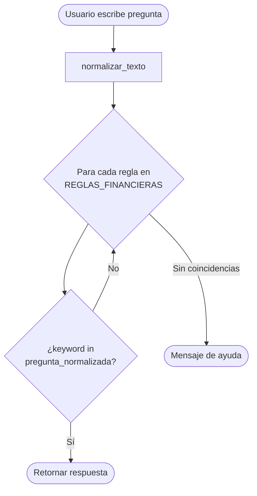
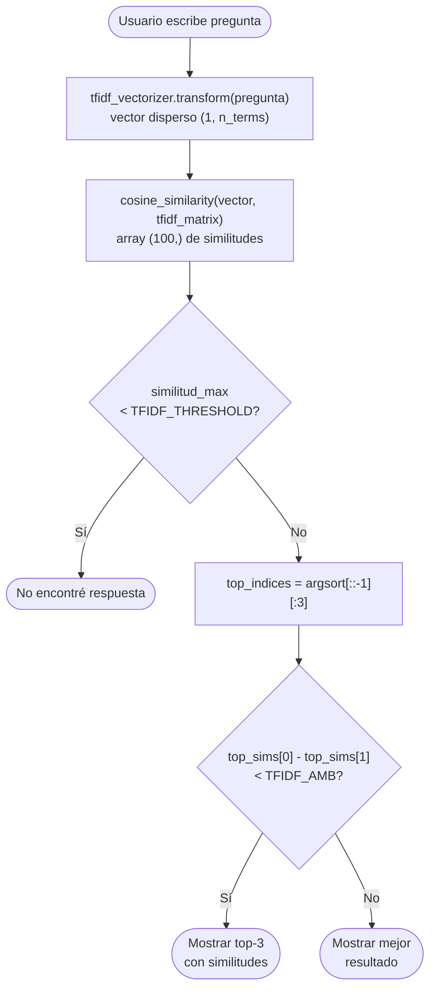
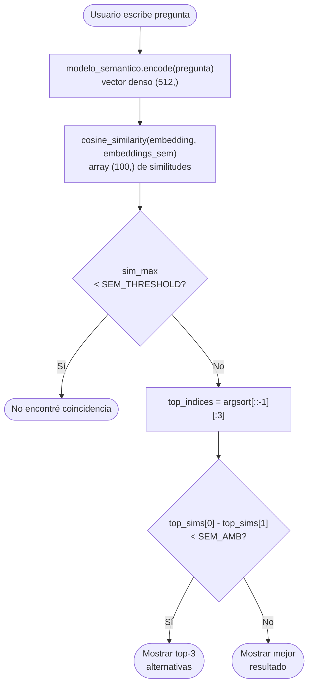
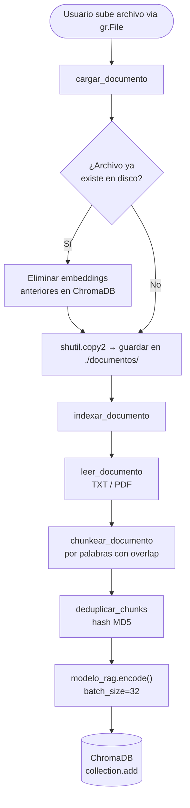
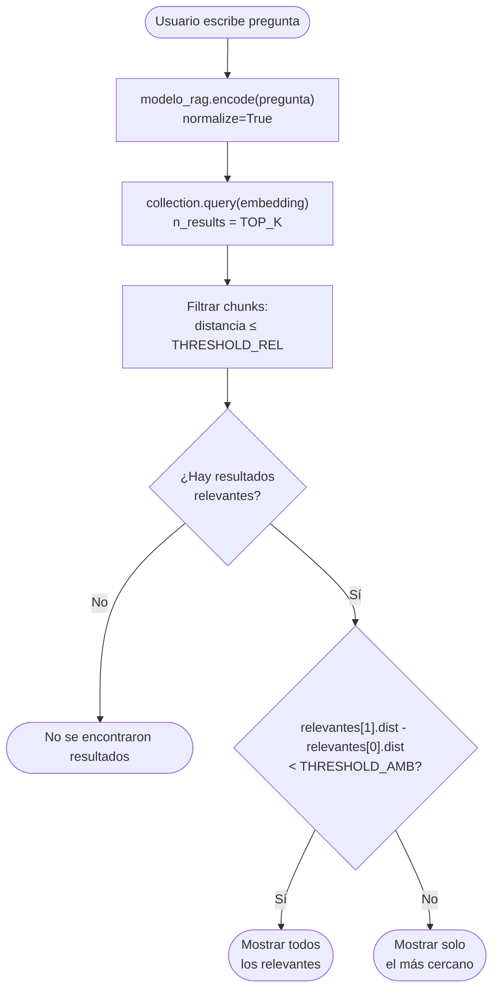

# Documentación — `app.py`
## Sistema Comparativo de Chatbots NLP · Asistencia Financiera


> **Descripción general:** Aplicación Gradio que integra cuatro arquitecturas de chatbot sobre un dominio de educación financiera. Cada arquitectura opera de forma completamente local y offline una vez descargados los modelos.

---

## Tabla de contenidos

1. [Instalación y dependencias](#1-instalación-y-dependencias)
2. [Estructura del proyecto](#2-estructura-del-proyecto)
3. [Configuración global](#3-configuración-global)
4. [Base de conocimiento financiero](#4-base-de-conocimiento-financiero)
5. [Inicialización de modelos y bases de datos](#5-inicialización-de-modelos-y-bases-de-datos)
6. [Módulo 1 — Chatbot por reglas](#6-módulo-1--chatbot-por-reglas)
7. [Módulo 2 — Chatbot TF-IDF](#7-módulo-2--chatbot-tf-idf)
8. [Módulo 3 — Chatbot semántico](#8-módulo-3--chatbot-semántico)
9. [Módulo 4 — Chatbot RAG](#9-módulo-4--chatbot-rag)
10. [Interfaz Gradio](#10-interfaz-gradio)
11. [Referencia de funciones](#11-referencia-de-funciones)
12. [Flujos de datos](#12-flujos-de-datos)
13. [Decisiones de diseño](#13-decisiones-de-diseño)

---

## 1. Instalación y dependencias

```bash
pip install gradio chromadb sentence-transformers scikit-learn pymupdf pandas numpy
```

| Librería | Uso |
|---|---|
| `gradio` | Interfaz web interactiva |
| `chromadb` | Base de datos vectorial persistente |
| `sentence-transformers` | Generación de embeddings semánticos |
| `scikit-learn` | `TfidfVectorizer` y `cosine_similarity` |
| `pymupdf` (`fitz`) | Extracción de texto de archivos PDF |
| `pandas` / `numpy` | Operaciones matriciales y de datos |
| `unicodedata` | Normalización de texto (tildes, diacríticos) |
| `hashlib` | Deduplicación de chunks por MD5 |
| `pathlib` | Manejo de rutas de archivos |

### Modelos descargados automáticamente

| Modelo | Uso | Descarga |
|---|---|---|
| `distiluse-base-multilingual-cased-v2` | Embeddings semánticos multilingües | Primer uso |
| `BAAI/bge-m3` | Embeddings RAG multilingües | Primer uso |

---

## 2. Estructura del proyecto

```
proyecto/
├── app.py                  ← Archivo principal
├── documentos/             ← PDFs y TXTs subidos para el RAG (creado automáticamente)
└── vector_db/              ← Base de datos ChromaDB persistente (creado automáticamente)
```

Los dos directorios se crean automáticamente al iniciar la aplicación si no existen.

---

## 3. Configuración global

Todas las constantes configurables se declaran al inicio del archivo. Modificarlas permite ajustar el comportamiento de los modelos sin tocar la lógica interna.

### Rutas y colección

| Constante | Valor por defecto | Descripción |
|---|---|---|
| `DOCS_DIR` | `./documentos` | Directorio donde se almacenan los archivos subidos al RAG |
| `VECTOR_DB_DIR` | `./vector_db` | Directorio de la base de datos vectorial ChromaDB |
| `COLLECTION_NAME` | `"rag_collection"` | Nombre de la colección dentro de ChromaDB |

### Chunking (RAG)

| Constante | Valor | Descripción |
|---|---|---|
| `CHUNK_WORDS` | `120` | Número de palabras por chunk |
| `CHUNK_OVERLAP_W` | `20` | Palabras de solapamiento entre chunks consecutivos |

> El solapamiento garantiza que el contexto entre chunks no se pierda en los límites del corte.

### Retrieval RAG

| Constante | Valor | Descripción |
|---|---|---|
| `TOP_K` | `5` | Número máximo de chunks recuperados por consulta |
| `THRESHOLD_REL` | `0.60` | Distancia coseno máxima para considerar un chunk relevante |
| `THRESHOLD_AMB` | `0.05` | Diferencia mínima entre top-1 y top-2 para detectar ambigüedad |

> ChromaDB con métrica coseno devuelve distancias en el rango [0, 2]: `0` = idéntico, `2` = opuesto. Un chunk se considera relevante si su distancia es `≤ THRESHOLD_REL`.

### Modelos

| Constante | Valor |
|---|---|
| `MODEL_SEMANTICO` | `"distiluse-base-multilingual-cased-v2"` |
| `MODEL_RAG` | `"BAAI/bge-m3"` |

### Thresholds TF-IDF

| Constante | Valor | Descripción |
|---|---|---|
| `TFIDF_THRESHOLD` | `0.20` | Similitud coseno mínima para emitir una respuesta |
| `TFIDF_AMB` | `0.05` | Diferencia entre top-1 y top-2 para detectar ambigüedad |

### Thresholds semántico

| Constante | Valor | Descripción |
|---|---|---|
| `SEM_THRESHOLD` | `0.35` | Similitud coseno mínima para emitir una respuesta |
| `SEM_AMB` | `0.05` | Diferencia entre top-1 y top-2 para detectar ambigüedad |

---

## 4. Base de conocimiento financiero

### `PREGUNTAS_FINANCIERAS` y `RESPUESTAS_FINANCIERAS`

Dos listas paralelas de **100 elementos** cada una que forman el corpus del dominio financiero. El índice `i` de `PREGUNTAS_FINANCIERAS` corresponde exactamente al índice `i` de `RESPUESTAS_FINANCIERAS`.

Son compartidas por los tres primeros módulos (reglas, TF-IDF y semántico). Cubren los siguientes temas:

| Categoría | Ejemplos de preguntas |
|---|---|
| Activos e instrumentos | Activos financieros, bonos, acciones, ETFs, fondos mutuos |
| Riesgos financieros | Riesgo de mercado, crédito, liquidez, inflación, tipo de cambio |
| Criptomonedas | Bitcoin, altcoins, stablecoins, DeFi, exchanges |
| Actores del mercado | Emisores, inversores, brokers, dealers, bolsas de valores |
| Perfiles de inversión | Conservador, moderado, agresivo, tolerancia al riesgo |
| Finanzas personales | Presupuesto, fondo de emergencia, patrimonio neto, ingresos pasivos |
| Conceptos matemáticos | Interés simple, interés compuesto, tasas nominales y reales |
| Deuda y crédito | Tarjetas de crédito, hipotecas, amortización, historial crediticio |
| Macroeconomía | Inflación, deflación, PIB, recesión, Bull/Bear market |
| Estrategias | Diversificación, DCA, gestión activa/pasiva |

---

## 5. Inicialización de modelos y bases de datos

Esta sección se ejecuta una sola vez al arrancar la aplicación. Todas las estructuras calculadas aquí se reutilizan en cada consulta posterior, evitando recomputaciones costosas.

### Modelos de embeddings

```python
modelo_semantico = SentenceTransformer("distiluse-base-multilingual-cased-v2")
modelo_rag       = SentenceTransformer("BAAI/bge-m3")
```

### ChromaDB

```python
chroma_client = chromadb.PersistentClient(path="./vector_db", ...)
collection    = chroma_client.get_or_create_collection(
    name="rag_collection",
    metadata={"hnsw:space": "cosine"}
)
```

La colección usa **distancia coseno** como métrica. Si ya existe de una ejecución anterior, se reutiliza sin borrar los documentos indexados.

### Matriz TF-IDF precalculada

```python
tfidf_vectorizer = TfidfVectorizer()
tfidf_matrix     = tfidf_vectorizer.fit_transform(PREGUNTAS_FINANCIERAS)
# Resultado: matriz dispersa de shape (100, n_términos)
```

### Embeddings semánticos precalculados

```python
embeddings_sem = modelo_semantico.encode(
    PREGUNTAS_FINANCIERAS,
    batch_size=32,
    normalize_embeddings=True,
)
# Resultado: array de shape (100, 512)
```

---

## 6. Módulo 1 — Chatbot por reglas

### Descripción

Chatbot determinista basado en coincidencia de palabras clave. No utiliza ningún modelo estadístico ni neuronal. Responde únicamente si el texto del usuario contiene una o más keywords predefinidas.

### `REGLAS_FINANCIERAS`

Lista de tuplas con la estructura `(lista_de_keywords, respuesta_string)`. Contiene **30 reglas** organizadas en cuatro categorías:

| Categoría | Reglas |
|---|---|
| Saludos / despedidas / meta | hola, adiós, gracias, ayuda |
| Conceptos financieros básicos | activos, bonos, acciones, ETFs, fondos, diversificación, portafolio |
| Riesgos | riesgo de mercado, crédito, liquidez, inflación, inflación general |
| Criptomonedas | Bitcoin, criptomonedas, altcoins, stablecoins, DeFi, exchanges |
| Finanzas personales | interés compuesto, presupuesto, fondo de emergencia, libertad financiera, renta fija/variable, bolsa, índices, dividendos |

### Funciones

#### `normalizar_texto(texto: str) -> str`

Preprocesamiento ligero aplicado tanto a la pregunta del usuario como a cada keyword antes de la comparación. Evita que diferencias de tildes o mayúsculas rompan la coincidencia.

**Pasos:**
1. Descompone caracteres Unicode en forma NFD (separa letras de sus diacríticos).
2. Elimina todas las marcas diacríticas (tildes, diéresis).
3. Convierte a minúsculas.

```python
normalizar_texto("¿Qué es la Inflación?")
# → "que es la inflacion"
```

---

#### `respuesta_por_reglas(pregunta: str) -> str`

**Entrada:** pregunta del usuario como string.  
**Salida:** string con la respuesta de la primera regla que coincida, o mensaje de no encontrado.

**Algoritmo:**
1. Valida que la pregunta no esté vacía.
2. Normaliza la pregunta con `normalizar_texto()`.
3. Itera sobre `REGLAS_FINANCIERAS`. Para cada regla, itera sobre sus keywords.
4. Si alguna keyword normalizada está contenida en la pregunta normalizada, retorna la respuesta asociada (primera coincidencia gana).
5. Si ninguna regla coincide, retorna un mensaje de ayuda con los temas disponibles.

**No usa:** embeddings, TF-IDF, ni ningún modelo de ML.

---

## 7. Módulo 2 — Chatbot TF-IDF

### Descripción

Chatbot estadístico que vectoriza la pregunta del usuario usando el vocabulario aprendido de `PREGUNTAS_FINANCIERAS` y recupera la respuesta de la pregunta más cercana por similitud coseno.

### Funcionamiento interno

- **Vectorización:** `TfidfVectorizer` transforma cada pregunta en un vector disperso donde cada dimensión representa un término del vocabulario, ponderado por su frecuencia en el documento (TF) e inversamente por su frecuencia en el corpus (IDF).
- **Similitud coseno:** mide el ángulo entre el vector de la pregunta del usuario y cada vector de la base. Valores cercanos a 1 indican alta similitud léxica.
- **La matriz y el vectorizador se calculan una sola vez al inicio**, no en cada consulta.

---

#### `respuesta_tfidf(pregunta: str) -> str`

**Entrada:** pregunta del usuario como string.  
**Salida:** string formateado con similitud, pregunta de referencia y respuesta; o mensaje de umbral no alcanzado.

**Algoritmo:**
1. Valida que la pregunta no esté vacía.
2. Vectoriza la pregunta con `tfidf_vectorizer.transform([pregunta])`.
3. Calcula `cosine_similarity` entre el vector de la pregunta y `tfidf_matrix`.
4. Obtiene la similitud máxima. Si es menor que `TFIDF_THRESHOLD`, retorna mensaje de no encontrado.
5. Extrae los top-3 índices por similitud descendente.
6. **Detecta ambigüedad:** si top-1 y top-2 ambos superan el umbral y su diferencia es menor que `TFIDF_AMB`, el resultado es ambiguo.
7. **Sin ambigüedad:** retorna la pregunta de referencia, la similitud y la respuesta del mejor resultado.
8. **Con ambigüedad:** retorna hasta 3 opciones con sus similitudes y respuestas.

**Manejo de errores:** `try/except` alrededor de la vectorización y el cálculo de similitud.

---

## 8. Módulo 3 — Chatbot semántico

### Descripción

Chatbot neuronal que genera un embedding denso de la pregunta del usuario usando un modelo transformer multilingüe y lo compara contra los embeddings precalculados de la base de conocimiento.

### Diferencia clave con TF-IDF

TF-IDF es léxico: "carro" y "automóvil" son vectores completamente distintos. Los embeddings semánticos son densos y capturan el significado: preguntas parecidas tienen vectores cercanos aunque usen vocabulario diferente. El modelo `distiluse-base-multilingual-cased-v2` permite además consultas **cross-lingual** (pregunta en español, preguntas de referencia en inglés, o viceversa).

### Decisión de diseño: sin limpieza agresiva de texto

A diferencia de pipelines NLP clásicos, **no se aplica stemming, lematización, ni eliminación de stopwords** antes de generar el embedding. Esto es correcto para modelos transformer porque:
- Las tildes y puntuación forman parte del contexto semántico.
- Eliminar stopwords puede destruir la estructura gramatical que el modelo usa para inferir significado.
- Solo se aplica `strip()` para eliminar espacios extremos.

---

#### `respuesta_semantica(pregunta: str) -> str`

**Entrada:** pregunta del usuario como string (español o inglés).  
**Salida:** string formateado con similitud coseno, pregunta de referencia y respuesta; o mensaje de umbral no alcanzado.

**Algoritmo:**
1. Valida que la pregunta no esté vacía.
2. Genera el embedding de la pregunta con `modelo_semantico.encode(pregunta.strip(), normalize_embeddings=True)`.
3. Calcula `cosine_similarity` entre el embedding de la pregunta y `embeddings_sem` (shape `(100, 512)`).
4. Obtiene la similitud máxima. Si es menor que `SEM_THRESHOLD`, retorna mensaje de no encontrado.
5. Extrae los top-3 índices por similitud descendente.
6. **Detecta ambigüedad:** misma lógica que TF-IDF pero con `SEM_AMB`.
7. Retorna resultado único o múltiples alternativas según ambigüedad.

**Manejo de errores:** `try/except` separado para la generación del embedding y para el cálculo de similitud.

---

## 9. Módulo 4 — Chatbot RAG

### Descripción

Sistema de Recuperación Aumentada con Generación (RAG) que permite al usuario subir documentos propios en formato PDF o TXT, indexarlos en una base de datos vectorial ChromaDB y consultarlos semánticamente. El modelo de embeddings es `BAAI/bge-m3`, diseñado para retrieval multilingüe de alta calidad.

### Pipeline completo

```
Documento (PDF/TXT)
    │
    ▼
leer_documento()         ← extrae texto plano
    │
    ▼
chunkear_documento()     ← divide en fragmentos de N palabras con overlap
    │
    ▼
deduplicar_chunks()      ← elimina fragmentos duplicados por hash MD5
    │
    ▼
modelo_rag.encode()      ← genera embeddings (batch_size=32)
    │
    ▼
ChromaDB.add()           ← almacena embeddings + texto + metadata
```

```
Pregunta del usuario
    │
    ▼
modelo_rag.encode()      ← embedding de la pregunta
    │
    ▼
ChromaDB.query()         ← top-K chunks más cercanos por distancia coseno
    │
    ▼
Filtrado por THRESHOLD_REL
    │
    ▼
Detección de ambigüedad
    │
    ▼
Resultado formateado (fuente, chunk_id, distancia, texto)
```

---

### Funciones del módulo RAG

#### `leer_documento(ruta: Path) -> str`

**Entrada:** objeto `Path` apuntando al archivo.  
**Salida:** texto plano del documento como string.

| Formato | Método |
|---|---|
| `.txt` | `Path.read_text(encoding="utf-8")`, con fallback a `"latin-1"` si falla |
| `.pdf` | `fitz.open()` + `pagina.get_text("text")` por cada página |
| Otro | Lanza `ValueError` con mensaje de formato no soportado |

Todos los errores de lectura se registran con `print` y se re-lanzan para que el llamador los maneje.

---

#### `chunkear_documento(texto, chunk_words=120, overlap_words=20) -> List[str]`

**Entrada:** texto plano, tamaño de chunk en palabras, solapamiento en palabras.  
**Salida:** lista de strings (chunks).

**Algoritmo:**
1. Tokeniza el texto por espacios con `texto.split()`.
2. Recorre las palabras con un índice de inicio que avanza `chunk_words - overlap_words` en cada iteración.
3. Cada chunk es un segmento de `chunk_words` palabras re-unidas con `" ".join()`.
4. **Filtrado:** se descartan chunks con menos de 8 palabras o que no contengan al menos una letra (filtra ruido, símbolos, separadores).

**Sobre el overlap:** con `chunk_words=120` y `overlap_words=20`, cada chunk comparte las últimas 20 palabras con el siguiente. Esto garantiza que una oración que cae en el límite entre dos chunks sea capturada completamente en al menos uno de ellos.

---

#### `deduplicar_chunks(chunks: List[str]) -> List[str]`

**Entrada:** lista de chunks (posiblemente con duplicados).  
**Salida:** lista de chunks únicos en el mismo orden original.

Calcula el hash MD5 de cada chunk en bytes UTF-8. Usa un `set` para rastrear los hashes ya vistos. El primer chunk con un hash dado se conserva; los siguientes se descartan. Preserva el orden de aparición.

---

#### `cargar_documento(archivos) -> str`

**Entrada:** un archivo o lista de archivos provenientes del componente `gr.File` de Gradio.  
**Salida:** string con el mensaje de estado de cada archivo procesado.

**Comportamiento ante duplicados:**
- Si el archivo ya existe en `DOCS_DIR`, consulta ChromaDB por todos los chunks con `source == nombre_archivo`, los elimina, y luego sobreescribe el archivo físico.
- Si el archivo es nuevo, lo copia directamente.

El guardado físico se realiza con `shutil.copy2()` para preservar metadatos del archivo original.

---

#### `indexar_documento(nombre_archivo: str) -> str`

**Entrada:** nombre del archivo (debe existir en `DOCS_DIR`).  
**Salida:** mensaje de confirmación con cantidad de chunks y embeddings generados, o mensaje de error.

**Pipeline interno:**
1. Verifica que el archivo existe en disco.
2. Llama a `leer_documento()`.
3. Llama a `chunkear_documento()`.
4. Llama a `deduplicar_chunks()`.
5. Limpia embeddings previos del mismo documento en ChromaDB (por si fue subido antes sin pasar por `cargar_documento`).
6. Genera embeddings con `modelo_rag.encode(..., batch_size=32, normalize_embeddings=True)`.
7. Construye IDs únicos con el patrón `{nombre_limpio}__chunk_{i}` (nombre sanitizado con regex `[^a-zA-Z0-9_\-]` → `_`).
8. Inserta en ChromaDB con `collection.add(ids, embeddings, documents, metadatas)`.

**Metadata almacenada por chunk:**

```python
{"source": nombre_archivo, "chunk_id": i}
```

---

#### `eliminar_documento(nombre_archivo: str) -> str`

**Entrada:** nombre del archivo a eliminar.  
**Salida:** string con el resultado de cada operación (ChromaDB + disco).

**Pasos:**
1. Consulta ChromaDB con `collection.get(where={"source": nombre_archivo})` para obtener todos los IDs asociados.
2. Si hay IDs, los elimina con `collection.delete(ids=ids)`.
3. Si el archivo existe en disco, lo elimina con `Path.unlink()`.
4. Retorna mensajes descriptivos de cada paso, incluyendo errores individuales si los hay.

---

#### `consultar_rag(pregunta: str) -> str`

**Entrada:** pregunta del usuario como string.  
**Salida:** string formateado con los fragmentos recuperados, su fuente, chunk ID y distancia.

**Algoritmo:**
1. Valida que la pregunta no esté vacía y que la colección tenga al menos un documento.
2. Genera el embedding de la pregunta con `modelo_rag.encode()`.
3. Consulta ChromaDB con `n_results=min(TOP_K, collection.count())`.
4. Filtra los resultados: solo conserva los que tengan `distancia ≤ THRESHOLD_REL`.
5. Si no hay resultados relevantes, retorna mensaje con la distancia mínima obtenida.
6. **Detecta ambigüedad:** si `relevantes[1].distancia - relevantes[0].distancia < THRESHOLD_AMB`, hay múltiples resultados igual de buenos.
7. Sin ambigüedad: muestra solo el resultado más cercano.
8. Con ambigüedad: muestra todos los resultados relevantes.

**Formato de salida:**
```
Resultado más relevante para: 'tu pregunta'
────────────────────────────────────────────────────────────
Fragmento recuperado
Fuente   : nombre_archivo.pdf
Chunk ID : 3
Distancia: 0.2341  (0=idéntico · menor=más relevante)

[texto del fragmento]
────────────────────────────────────────────────────────────
```

---

### Funciones auxiliares RAG

#### `listar_documentos() -> List[str]`

Retorna una lista ordenada alfabéticamente con los nombres de todos los archivos `.txt` y `.pdf` presentes en `DOCS_DIR`.

#### `listar_documentos_texto() -> str`

Retorna la misma lista en formato de texto legible para mostrar en un `gr.Textbox`. Si no hay documentos, retorna `"No hay documentos cargados."`.

#### `metricas_rag() -> str`

Retorna un string Markdown con el estado actual del sistema RAG:
- Número de documentos en disco.
- Número total de chunks indexados en ChromaDB (`collection.count()`).
- Nombre del modelo de embeddings.
- Ruta de la base de datos vectorial.

#### `pipeline_cargar_e_indexar(archivos) -> tuple`

Orquesta la carga física e indexación de uno o varios archivos. Llama secuencialmente a `cargar_documento()` e `indexar_documento()` para cada archivo. Retorna una tupla de 4 elementos para actualizar los componentes Gradio: `(mensaje_estado, lista_docs_texto, dropdown_actualizado, metricas_actualizadas)`.

#### `pipeline_eliminar(nombre_archivo) -> tuple`

Orquesta la eliminación. Llama a `eliminar_documento()` y retorna la misma tupla de 4 elementos que `pipeline_cargar_e_indexar`.

---

## 10. Interfaz Gradio

### Estructura general

La aplicación usa un único `gr.Blocks` con **5 columnas** (`gr.Column`) que se muestran y ocultan dinámicamente mediante `gr.update(visible=...)`. Esto simula una navegación multipantalla dentro de una sola página.

```
gr.Blocks
├── pantalla_menu     (visible=True por defecto)
├── pantalla_reglas   (visible=False por defecto)
├── pantalla_tfidf    (visible=False por defecto)
├── pantalla_sem      (visible=False por defecto)
└── pantalla_rag      (visible=False por defecto)
    ├── gr.Tabs
    │   ├── Tab: Gestión de Documentos
    │   └── Tab: Consultar RAG
```

### Pantalla principal (`pantalla_menu`)

Muestra una tabla comparativa de las 4 arquitecturas y 4 botones de navegación organizados en 2 filas de 2 columnas.

### Pantalla de cada modelo

Cada pantalla incluye:
- Encabezado con el nombre del modelo y sus parámetros técnicos.
- Botón **"← Volver al menú principal"**.
- `gr.Textbox` de entrada para la pregunta.
- Botón **"Consultar →"** (también funciona con `Enter` vía `.submit()`).
- `gr.Textbox` de salida con la respuesta (no editable, fuente monoespaciada).
- `gr.Examples` con preguntas sugeridas clickeables.

### Pantalla RAG (`pantalla_rag`)

Adicionalmente contiene:
- **Tab "Gestión de Documentos":** `gr.File` para subir archivos, botón de carga, dropdown de selección para eliminar, estado de documentos indexados y panel de métricas.
- **Tab "Consultar RAG":** campo de pregunta, botón de consulta y área de resultados.

### Navegación

La navegación usa funciones dedicadas con `gr.update()` explícito para evitar problemas de closure de Python y de comparación de objetos Gradio:

```python
def ir_a_reglas():
    return (gr.update(visible=False), gr.update(visible=True),
            gr.update(visible=False), gr.update(visible=False), gr.update(visible=False))
```

Los 5 valores retornados corresponden en orden a: `(pantalla_menu, pantalla_reglas, pantalla_tfidf, pantalla_sem, pantalla_rag)`.

### Estilos CSS

```css
.menu-btn       { font-size: 1.1em; padding: 18px 12px; border-radius: 10px; font-weight: 600; }
.output-mono    { font-family: 'Courier New'; font-size: 0.88em; white-space: pre-wrap; }
.back-btn       { margin-top: 8px; }
.section-title  { border-bottom: 2px solid #334155; margin-bottom: 12px; }
```

### Ejemplos precargados

| Pantalla | Variable | Cantidad |
|---|---|---|
| Reglas | `EJEMPLOS_REGLAS` | 10 |
| TF-IDF | `EJEMPLOS_TFIDF` | 8 |
| Semántico | `EJEMPLOS_SEM` | 8 |
| RAG | `EJEMPLOS_RAG` | 5 |

---

## 11. Referencia de funciones

| Función | Módulo | Descripción breve |
|---|---|---|
| `normalizar_texto()` | Reglas | Elimina tildes y convierte a minúsculas |
| `respuesta_por_reglas()` | Reglas | Responde por coincidencia de keywords |
| `respuesta_tfidf()` | TF-IDF | Responde por similitud coseno TF-IDF |
| `respuesta_semantica()` | Semántico | Responde por similitud de embeddings |
| `leer_documento()` | RAG | Lee TXT o PDF y retorna texto plano |
| `chunkear_documento()` | RAG | Divide texto en chunks por palabras con overlap |
| `deduplicar_chunks()` | RAG | Elimina chunks duplicados por hash MD5 |
| `cargar_documento()` | RAG | Guarda archivos en disco, maneja duplicados |
| `indexar_documento()` | RAG | Indexa un documento completo en ChromaDB |
| `eliminar_documento()` | RAG | Elimina archivo del disco y ChromaDB |
| `consultar_rag()` | RAG | Recupera chunks relevantes por similitud coseno |
| `listar_documentos()` | RAG helper | Lista archivos `.txt` y `.pdf` en `DOCS_DIR` |
| `listar_documentos_texto()` | RAG helper | Versión formateada de `listar_documentos()` |
| `metricas_rag()` | RAG helper | Estado del sistema RAG en Markdown |
| `pipeline_cargar_e_indexar()` | RAG pipeline | Carga + indexación + actualiza componentes UI |
| `pipeline_eliminar()` | RAG pipeline | Eliminación + actualiza componentes UI |
| `construir_app()` | UI | Construye y retorna la aplicación Gradio completa |
| `ir_a_reglas()` | Navegación | Muestra pantalla de reglas, oculta el resto |
| `ir_a_tfidf()` | Navegación | Muestra pantalla TF-IDF, oculta el resto |
| `ir_a_sem()` | Navegación | Muestra pantalla semántica, oculta el resto |
| `ir_a_rag()` | Navegación | Muestra pantalla RAG, oculta el resto |
| `ir_a_menu()` | Navegación | Muestra menú principal, oculta el resto |

---

## 12. Flujos de datos

### Flujo: consulta a chatbot de reglas



### Flujo: consulta TF-IDF



### Flujo: consulta semántica



### Flujo: carga de documento RAG



### Flujo: consulta RAG



---

## 13. Decisiones de diseño

### Por qué precalcular la matriz TF-IDF y los embeddings semánticos al inicio

Ambas operaciones son costosas computacionalmente. Calcularlas en cada consulta introduciría latencias de varios segundos por pregunta. Al realizarlas una sola vez al arrancar:
- La matriz TF-IDF queda en memoria RAM como una matriz dispersa de scipy.
- Los embeddings semánticos quedan en memoria como un array NumPy de `(100, 512)`.
- Cada consulta solo requiere una transformación (TF-IDF) o un encode (semántico) de la pregunta individual, que es instantáneo.

### Por qué no limpiar texto antes de los embeddings semánticos

Los modelos transformer como `distiluse` están entrenados con texto natural completo. Eliminar tildes o stopwords antes de encodear degrada la representación semántica porque:
- "no sé" y "sé" tienen significados distintos aunque "no" sea una stopword.
- "interés" e "interes" son el mismo concepto, pero el modelo fue entrenado con tildes y las maneja correctamente.

### Por qué chunking por palabras y no por caracteres

El chunking por caracteres puede cortar palabras a mitad, generando tokens inválidos que degradan la calidad de los embeddings. El chunking por palabras garantiza que cada chunk contenga únicamente palabras completas, preservando la coherencia semántica.

### Por qué deduplicar chunks antes de indexar

Documentos con secciones repetidas (encabezados, pies de página, boilerplate legal) generarían chunks idénticos que ocuparían espacio en ChromaDB y podrían sesgar los resultados de retrieval al hacer que ciertos fragmentos aparezcan con mayor frecuencia artificialmente.

### Por qué usar `gr.update(visible=...)` en lugar de `gr.Column(visible=...)`

Dentro de un callback de Gradio, retornar una instancia nueva de `gr.Column()` intenta crear un componente nuevo en lugar de actualizar el existente. `gr.update()` es la API correcta para modificar el estado de un componente ya renderizado.

### Por qué no usar un loop para conectar los botones "Volver"

```python
# INCORRECTO — closure bug
for btn in [btn1, btn2, btn3]:
    btn.click(fn=lambda: hacer_algo(btn))  # todos ejecutan con el último valor de btn
```

Python captura la variable `btn` por referencia en el closure, no por valor. Al momento de ejecutar el callback, `btn` ya tiene el valor del último elemento del loop. Conectar cada botón individualmente a una función dedicada evita este problema clásico.

